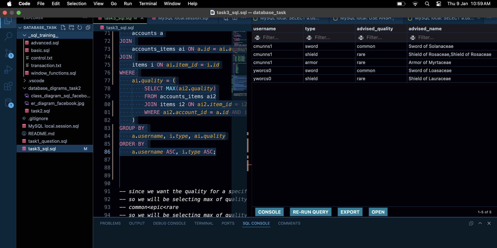

# Database Concepts README

## 1. Introduction to Databases
- **History and evolution:** Understand the journey from file-based systems to modern databases.
- **Types:** Relational (structured tables) vs. Non-relational (flexible schemas).
- **DBMS:** Tools for creating, managing, and interacting with databases.
- **SQL vs. NoSQL:** SQL for structured data; NoSQL for flexibility and scalability.

## 2. Relational Database Fundamentals
- **Database design:** Plan schemas for efficient data storage and retrieval.
- **ER model:** Visualize data entities and relationships.
- **Tables:** Structures with rows and columns to store data.
- **Keys:** Primary keys for uniqueness, foreign keys for relationships.
- **Normalization:** Organize data to reduce redundancy (1NF, 2NF, 3NF, BCNF).
- **Denormalization:** Use for performance trade-offs when needed.

## 3. Basic SQL Commands
- **DDL:** Create, modify, or delete database structures (CREATE, ALTER, DROP).
- **DML:** Manipulate data (SELECT, INSERT, UPDATE, DELETE).
- **DCL:** Manage permissions (GRANT, REVOKE).
- **TCL:** Control transactions (BEGIN, COMMIT, ROLLBACK).

## 4. Advanced SQL Queries
- **Joins:** Combine rows from multiple tables (Inner, Outer, Cross).
- **Subqueries:** Nested queries for advanced filtering.
- **Set operations:** Combine results (UNION, INTERSECT, EXCEPT).
- **Window functions:** Perform row-wise calculations (ROW_NUMBER, RANK).
- **CTEs:** Simplify complex queries with temporary result sets.
- **Pivoting:** Transform rows into columns and vice versa.

## 5. Database Design and Optimization
- **Indexing:** Speed up queries (clustered, non-clustered, covering).
- **Query optimization:** Techniques for efficient query execution.
- **Explain plans:** Analyze and optimize query execution paths.
- **Partitioning/Sharding:** Divide data for performance and scalability.
- **Concurrency:** Ensure data consistency in multi-user environments.
- **Deadlocks:** Detect and resolve resource contention.

## 6. Stored Procedures and Functions
- **Stored procedures:** Encapsulate logic for reusability.
- **Functions:** Return values for calculations or transformations.
- **Triggers:** Automate actions on data changes.
- **Error handling:** Manage exceptions in procedures.

# Database Topics Overview

## 7. Database Security
- **Authentication and authorization**: Mechanisms to verify user identity and grant access to resources.
- **Role-based access control (RBAC)**: Assigning permissions based on user roles to ensure proper security.
- **Encryption: data-at-rest, data-in-transit**: Protecting sensitive data during storage and transfer using cryptographic techniques.
- **SQL injection and how to prevent it**: Protecting databases from malicious queries by using parameterized statements.
- **Auditing and compliance**: Tracking database activities and ensuring adherence to regulatory standards.

## 8. Advanced Topics in SQL
- **Full-text search**: Efficiently querying large text-based data for relevant information.
- **Temporal tables**: Managing historical and current data for time-sensitive applications.
- **JSON and XML data handling**: Storing, querying, and processing semi-structured data within SQL databases.
- **Dynamic SQL and metaprogramming**: Generating and executing SQL queries dynamically at runtime.
- **Spatial data and GIS functions**: Storing and querying geographic and spatial data using SQL extensions.

## 9. Big Data and NoSQL Databases
- **Introduction to Big Data concepts**: Exploring massive data sets that exceed traditional processing limits.
- **Differences between SQL and NoSQL**: Contrasting structured relational databases with flexible, schema-less NoSQL systems.
- **Popular NoSQL databases: MongoDB, Cassandra, Redis**: Overview of widely used NoSQL database technologies.
- **Integrating SQL databases with Big Data technologies (Hadoop, Spark)**: Combining SQL databases with Big Data tools for advanced analytics.

